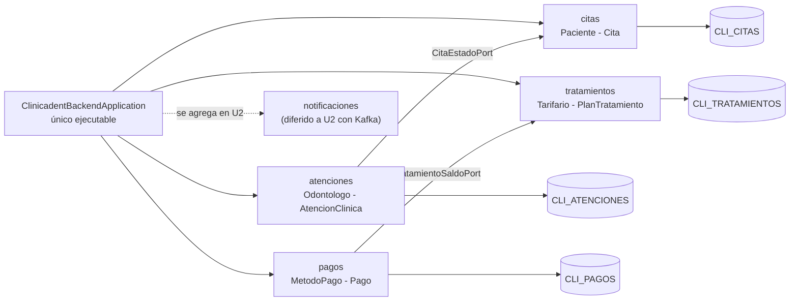

# LP2 - Producto de Unidad 1

**Esta es la plantilla del producto de Unidad 1 de LP2 para el Sistema de Gestión Odontológica ClinicaDent.** La estructura (alcance arquitectónico, contrato REST, DTO principales, arquitectura backend, casos de prueba y trazabilidad con ADS/BD2) es exigible al equipo completo: monolito modular verificado, operaciones transaccionales cabecera-detalle reales, persistencia en Oracle Database, consultas agregadas, CORS, logs y pruebas transversales de arquitectura.

**Equipo:** InnovateX

**Integrantes y roles:**
- Eddy Brayan Huaman Taco (Módulo 1: Citas y Admisión)
- Paul Cariapaza Sacachipana (Módulo 2: Catálogo y Tratamientos)
- Erick Midwar Calsin Chura (Módulo 3: Atenciones Clínicas)
- Axcel Daniel Vargas Quispe (Módulo 4: Pagos y Caja)

---

## Producto

**Backend REST modular ensamblado como una sola aplicación Spring Boot (Java 21), conectado a Oracle Database Free (`FREEPDB1`), con persistencia ORM, CRUD maestros, operaciones cabecera–detalle, consultas agregadas, CORS, logs y pruebas de arquitectura con Spring Modulith.**

La solución expone el flujo transaccional integral de un centro odontológico: `Paciente – Cita – Tratamiento – Atencion – Pago`. El backend real está organizado como un monolito modular: `citas`, `tratamientos`, `atenciones` y `pagos` quedan 100% funcionales en U1; el módulo de `notificaciones` (asíncrono con Apache Kafka) conserva sus límites preparados para su evolución en la Unidad 2. La autenticación de usuarios con Spring Security y JWT no forma parte de U1 y se incorpora formalmente en la Sesión 10.

---

## 1. Alcance arquitectónico del corte

```text
backend/                     # un solo proyecto Maven, sin reactor multi-módulo
└── src/main/java/pe/edu/upeu/clinica/
    ├── ClinicadentBackendApplication.java   # único Spring Boot ejecutable
    ├── shared/                              # configuración OpenAPI, DTOs compartidos y excepciones globales
    │   ├── config/                          # OpenApiConfig
    │   ├── dto/                             # ApiErrorResponse
    │   └── exception/                       # GlobalExceptionHandler, MontoExcedidoException, ReglaNegocioException
    ├── citas/                               # M1 funcional: Eddy Brayan Huaman Taco
    │   ├── paciente/                        # CRUD maestro de pacientes
    │   ├── cita/                            # Transaccional Cita - DetalleCita
    │   └── CitaEstadoPort.java              # Puerto de servicio público hacia atenciones
    ├── tratamientos/                        # M2 funcional: Paul Cariapaza Sacachipana
    │   ├── catalogo/                        # Catálogo base: Especialidad y Procedimiento (Tarifario)
    │   ├── plan/                            # Transaccional Tratamiento - DetalleTratamiento
    │   └── TratamientoSaldoPort.java        # Puerto de servicio público hacia pagos
    ├── atenciones/                          # M3 funcional: Erick Midwar Calsin Chura
    │   ├── odontologo/                      # CRUD maestro de odontólogos
    │   └── atencion/                        # Transaccional Atencion - DetalleAtencion
    └── pagos/                               # M4 funcional: Axcel Daniel Vargas Quispe
        └── pago/                            # Maestro MetodoPago y Transaccional Pago - DetallePago
```

Cada paquete directo bajo `pe.edu.upeu.clinica` es un módulo de aplicación con sus límites verificados automáticamente por Spring Modulith, no un artefacto Maven separado[cite: 1, 3].

El módulo de `notificaciones` (asíncrono con Apache Kafka) no forma parte del alcance funcional de la Unidad 1[cite: 1, 4]. Su límite conceptual y sus DTOs quedan documentados para evitar el acoplamiento cruzado y permitir que la evaluación conserve las 4 operaciones cabecera-detalle implementadas con profundidad en Oracle Database Free[cite: 1, 4].

---

## 2. Demo ejecutable

* **Consola Global de Swagger UI:** [http://localhost:8080/swagger-ui/index.html](http://localhost:8080/swagger-ui/index.html)[cite: 1, 4]
* **Verificación de Salud y Base de Datos (Actuator Health):** [http://localhost:8080/actuator/health](http://localhost:8080/actuator/health)[cite: 1, 4]
* **Especificación OpenAPI (JSON):** [http://localhost:8080/v3/api-docs](http://localhost:8080/v3/api-docs)[cite: 4]

> **Nota:** La documentación interactiva se encuentra agrupada en el menú superior desplegable (*Select a definition*) según los 4 módulos funcionales de la Unidad 1 (`modulo-1-citas`, `modulo-2-tratamientos`, `modulo-3-atenciones`, `modulo-4-pagos`)[cite: 4].

---

## 3. Contrato REST de referencia

**Tabla 1. Contrato REST de referencia de ClinicaDent**[cite: 1, 4]

| Método | Endpoint | Propósito | Integrante Responsable | Sesión relacionada |
|---|---|---|---|---|
| `POST` | `/api/v1/pacientes` | Registrar paciente en admisión clínica (CRUD Maestro). | Eddy Huaman | S2[cite: 4] |
| `GET` | `/api/v1/pacientes` | Consultar padrón general de pacientes registrados. | Eddy Huaman | S2[cite: 4] |
| `POST` | `/api/v1/citas` | Programar cita con validación de agenda médica (409 Conflict). | Eddy Huaman | S4[cite: 4] |
| `POST` | `/api/v1/citas/{id}/cancelar` | Cancelar cita y liberar franja horaria del consultorio. | Eddy Huaman | S4[cite: 4] |
| `POST` | `/api/v1/especialidades` | Registrar especialidad clínica en el catálogo base. | Paul Cariapaza | S2[cite: 4] |
| `POST` | `/api/v1/procedimientos` | Registrar procedimiento odontológico en tarifario base. | Paul Cariapaza | S2[cite: 4] |
| `POST` | `/api/v1/tratamientos` | Registrar plan de tratamiento cabecera-detalle con cálculo de costo. | Paul Cariapaza | S4[cite: 4] |
| `GET` | `/api/v1/tratamientos/{id}/saldo` | Consultar saldo deudor pendiente para el módulo de cobranzas. | Paul Cariapaza | S4[cite: 4] |
| `POST` | `/api/v1/odontologos` | Registrar odontólogo tratante con su número de colegiatura. | Erick Calsin | S2[cite: 4] |
| `POST` | `/api/v1/atenciones` | Registrar atención clínica y cambiar cita a `ATENDIDA` de forma atómica. | Erick Calsin | S4[cite: 4] |
| `GET` | `/api/v1/atenciones` | Listar atenciones clínicas con diagnóstico y recetas médicas. | Erick Calsin | S5[cite: 4] |
| `POST` | `/api/v1/metodos-pago` | Registrar medio de cobro en el catálogo de caja. | Axcel Vargas | S2[cite: 4] |
| `POST` | `/api/v1/pagos` | Registrar amortización validando saldo (`Abono <= Saldo`). | Axcel Vargas | S4[cite: 4] |
| `GET` | `/api/v1/pagos` | Listar amortizaciones históricas con filtros y ordenamiento dinámico. | Axcel Vargas | S5[cite: 4] |

---

## 4. DTO principales

### A. Módulo 1 (Citas): `CitaRequest` y `CitaResponse`

**DTO de Entrada (`CitaRequest`):**
```json
{
  "pacienteId": 1,
  "odontologoId": 2,
  "fecha": "2026-09-20",
  "horaInicio": "09:00:00",
  "horaFin": "09:30:00",
  "motivo": "Evaluación general y profilaxis",
  "detalles": [
    {
      "motivoConsulta": "Limpieza y diagnóstico",
      "tiempoEstimadoMinutos": 30
    }
  ]
}
```

**DTO de Salida (`CitaResponse`):**
```json
{
  "id": 101,
  "fecha": "2026-09-20",
  "horaInicio": "09:00:00",
  "horaFin": "09:30:00",
  "estado": "PROGRAMADA",
  "pacienteId": 1,
  "odontologoId": 2,
  "detalles": [
    {
      "id": 201,
      "motivoConsulta": "Limpieza y diagnóstico",
      "tiempoEstimadoMinutos": 30
    }
  ]
}
```

---

### B. Módulo 2 (Tratamientos): `TratamientoRequest` y `TratamientoResponse`

**DTO de Entrada (`TratamientoRequest`):**
```json
{
  "pacienteId": 1,
  "observaciones": "Plan inicial: profilaxis y curación con resina",
  "detalles": [
    { "procedimientoId": 1, "cantidad": 1, "precioUnitario": 80.00 },
    { "procedimientoId": 4, "cantidad": 2, "precioUnitario": 60.00 }
  ]
}
```

**DTO de Salida (`TratamientoResponse`):**
```json
{
  "id": 15,
  "pacienteId": 1,
  "fechaRegistro": "2026-09-13T09:00:00",
  "costoTotal": 200.00,
  "saldoPendiente": 200.00,
  "estado": "ACTIVO",
  "detalles": [
    { "id": 101, "procedimientoId": 1, "nombreProcedimiento": "Profilaxis profunda", "cantidad": 1, "precioUnitario": 80.00, "subtotal": 80.00 },
    { "id": 102, "procedimientoId": 4, "nombreProcedimiento": "Curación con resina", "cantidad": 2, "precioUnitario": 60.00, "subtotal": 120.00 }
  ]
}
```

---

### C. Módulo 3 (Atenciones): `AtencionRequest` y `AtencionResponse`

**DTO de Entrada (`AtencionRequest`):**
```json
{
  "citaId": 101,
  "odontologoId": 2,
  "diagnostico": "Caries de segundo grado en premolar superior",
  "recetaMedica": "Amoxicilina 500mg cada 8 horas por 3 días",
  "detalles": [
    {
      "piezaDental": "1.4",
      "procedimientoId": 4,
      "observaciones": "Curación con aislamiento absoluto"
    }
  ]
}
```

**DTO de Salida (`AtencionResponse`):**
```json
{
  "id": 301,
  "citaId": 101,
  "odontologoId": 2,
  "fechaAtencion": "2026-09-20T09:30:00",
  "diagnostico": "Caries de segundo grado en premolar superior",
  "recetaMedica": "Amoxicilina 500mg cada 8 horas por 3 días",
  "detalles": [
    {
      "id": 401,
      "piezaDental": "1.4",
      "procedimientoId": 4,
      "observaciones": "Curación con aislamiento absoluto"
    }
  ]
}
```

---

### D. Módulo 4 (Pagos): `PagoRequest` y `PagoResponse`

**DTO de Entrada (`PagoRequest`):**
```json
{
  "pacienteId": 1,
  "metodoPagoId": 1,
  "numeroComprobante": "B001-00042",
  "observacion": "Abono inicial de plan odontológico",
  "detalles": [
    {
      "tratamientoId": 15,
      "monto": 120.00,
      "concepto": "Amortización de curación y limpieza"
    }
  ]
}
```

**DTO de Salida (`PagoResponse`):**
```json
{
  "id": 501,
  "fechaPago": "2026-09-20T10:00:00",
  "pacienteId": 1,
  "metodoPagoId": 1,
  "numeroComprobante": "B001-00042",
  "montoTotal": 120.00,
  "observacion": "Abono inicial de plan odontológico",
  "detalles": [
    {
      "id": 901,
      "tratamientoId": 15,
      "monto": 120.00,
      "concepto": "Amortización de curación y limpieza"
    }
  ]
}
```

---

## 5. Arquitectura backend U1

**Figura 1. Arquitectura backend U1 de ClinicaDent**



Todos los módulos se ejecutan en la misma máquina virtual Java (JVM) y utilizan un datasource común hacia Oracle Database Free (`FREEPDB1`)[cite: 1, 4]. No existe comunicación HTTP interna ni Feign clients entre los paquetes de la aplicación. Cada módulo conserva sus controllers, servicios, entidades y repositorios JPA; los repositorios no se comparten entre módulos ajenos y la comunicación inter-módulo se realiza estrictamente a través de puertos de servicio (`CitaEstadoPort`, `TratamientoSaldoPort`)[cite: 1, 3].

---

## 6. Casos de prueba de la demo (Sustentación S06)

**Tabla 2. Casos de prueba obligatorios de la sustentación**

| Caso | Endpoint / Acción en Swagger | Resultado esperado |
|---|---|---|
| **Verificar backend** | `GET /actuator/health` en navegador o Postman[cite: 1]. | HTTP 200 `{"status": "UP", "components": {"db": {"status": "UP"}}}` con Oracle en Docker[cite: 1]. |
| **Verificar límites** | Ejecutar `mvn test -Dtest=ClinicadentBackendApplicationTests`[cite: 1, 3]. | `BUILD SUCCESS`; Spring Modulith valida límites de paquetes acíclicos[cite: 1, 3]. |
| **CRUD Maestro (Éxito)** | `POST /api/v1/pacientes` con DNI y datos completos[cite: 1, 4]. | HTTP 201 Created con ID persistido y secuencia autogenerada en Oracle[cite: 1, 4]. |
| **CRUD Maestro (Validación 400)** | `POST /api/v1/pacientes` (con campos requeridos vacíos)[cite: 1, 4]. | HTTP 400 Bad Request gestionado por `GlobalExceptionHandler` con `ApiErrorResponse`[cite: 1, 3]. |
| **Transacción Válida (Citas)** | `POST /api/v1/citas` asignando doctor y horario disponible[cite: 1, 4]. | HTTP 201 Created; registra cabecera y detalle de cita en estado `PROGRAMADA`[cite: 1, 4]. |
| **Conflicto de Horario (409)** | `POST /api/v1/citas` (mismo doctor y horario solapado)[cite: 1, 4]. | HTTP 409 Conflict; regla de no traslape en agenda médica rechaza el insert[cite: 1, 4]. |
| **Transacción Atómica (Atención)** | `POST /api/v1/atenciones` vinculada a la cita programada[cite: 1, 4]. | HTTP 201 Created; persiste diagnóstico/receta y actualiza cita a `ATENDIDA` vía port[cite: 1, 3, 4]. |
| **Transacción Válida (Pagos)** | `POST /api/v1/pagos` con abono menor o igual al saldo deudor[cite: 1, 4]. | HTTP 201 Created; descuenta el saldo pendiente del plan de tratamiento[cite: 1, 4]. |
| **Rollback Provocado (Pagos)** | `POST /api/v1/pagos` con monto que excede el saldo restante[cite: 1, 4]. | HTTP 409 Conflict (`MontoExcedidoException`); `@Transactional` revierte sin cambios[cite: 1, 3, 4]. |
| **Filtros Combinados** | `GET /api/v1/pagos` filtrando por paciente y método de pago[cite: 1, 4]. | HTTP 200 OK retornando la colección ordenada de amortizaciones persistidas[cite: 1, 4]. |

---

## 7. Trazabilidad con ADS y BD2

**Tabla 3. Matriz de trazabilidad curricular**[cite: 1]

| Elemento LP2 | ADS | BD2 |
|---|---|---|
| Monolito modular en capas[cite: 1, 4] | Diagrama C3, límites de contexto y comunicación por DTOs[cite: 1, 4] | Esquemas y tablas con propiedad funcional definida (`FREEPDB1`)[cite: 1, 3, 4] |
| Control `@Transactional` y rollback atómico[cite: 1, 4] | Consistencia de negocio clínico y conciliación de caja[cite: 1, 4] | Atomicidad ACID, sentencias `COMMIT` y `ROLLBACK` en Oracle[cite: 1, 4] |
| Validación `Abono <= Saldo` y agenda médica[cite: 1, 4] | Reglas de dominio de admisión y liquidación de deuda[cite: 1, 4] | Restricciones `CHECK`, claves foráneas e integridad referencial[cite: 1, 4] |
| Filtros combinados y ordenamiento dinámico[cite: 1, 4] | Requerimiento no funcional de rendimiento de endpoints[cite: 1, 4] | Optimización de índices en columnas de búsqueda por fechas[cite: 1, 4] |

---

## 8. Rúbrica de Evaluación

**Tabla 4. Rúbrica de evaluación de la Unidad 1**[cite: 1]

| Criterio | Peso | CE / Nivel | A (20 pts) | B (15 pts) | C (10 pts) | D (5 pts) | Calificación obtenida |
|---|---:|---|---|---|---|---|---:|
| 1. Crea y configura el proyecto backend con ORM, conexión a la base de datos, recurso REST inicial, DTO y documentación de API | 16% | CE023-N2 (parcial) | Proyecto ejecutable, conectado a Oracle, con contrato y versionado de API documentados y verificables en vivo. | Proyecto ejecutable y conectado, con documentación parcial. | Proyecto ejecutable con conexión o documentación incompleta. | No presenta un proyecto backend ejecutable. | |
| 2. Implementa un CRUD REST completo, con validaciones, excepciones, logs y pruebas transversales | 16% | CE023-N2 (parcial) | CRUD completo con validación, manejo de errores y trazabilidad probados con casos reales. | CRUD completo con validación parcial o trazabilidad incompleta. | CRUD incompleto o sin manejo de errores. | No presenta CRUD funcional. | |
| 3. Gestiona objetos relacionados mediante ORM, DTO y reglas de asociación | 16% | CE023-N2 (parcial) | Asociación entre entidades con DTO relacionado y navegación controlada, verificada en vivo. | Asociación funcional, con detalles menores en la navegación o el DTO. | Asociación incompleta o sin control de referencias. | No implementa objetos relacionados. | |
| 4. Implementa una operación cabecera-detalle con registro atómico, cálculos, estados, consistencia, commit y rollback | 16% | CE023-N2 (parcial) | Operación completa, con caso de éxito y caso de rollback probados y explicados. | Operación completa, con un caso probado. | Operación presente, sin evidencia clara de atomicidad. | No implementa la operación cabecera-detalle. | |
| 5. Implementa consultas, filtros, ordenamiento, agregaciones, reportes y configuración CORS | 16% | CE023-N2 (parcial) | Filtros combinados, reporte agregado y CORS configurado por propiedad, probados en vivo. | La mayoría de estos elementos funciona, con detalles menores. | Consultas o CORS incompletos. | No implementa consultas ni CORS. | |
| 6. Sustentación | 20% | CG | Sustenta con claridad y profesionalismo su aporte individual, respondiendo con precisión las preguntas del jurado. | Sustenta con solvencia, con detalles menores en claridad, orden o precisión. | Sustenta con dificultad; claridad, orden o precisión insuficientes. | No sustenta adecuadamente ni demuestra su aporte individual. | |

Nota final = suma de (`Peso` × `Puntos de la calificación obtenida`) / 100 × 20.[cite: 1]

`CE023-N2 (parcial)` = porción de backend REST del Nivel 2 de CE023 (Programación) — la otra porción (frontend SPA, JWT, integración full-stack) se completa en Unidad 2 de LP2[cite: 1]. `CG` = Competencia General "Innovación y solución de problemas" del sílabo de LP2 — no es CE023: los criterios 1-5 ya son la evidencia técnica, incluida su verificación en vivo; el criterio 6 verifica aporte individual y comunicación[cite: 1].

**Tabla 5. Subaspectos de la sustentación (Unidad 1)**[cite: 1]

El criterio 6 se evalúa con los mismos 6 subaspectos de la sustentación integral del Proyecto Integrador ([Guía de Sustentación Final](../u3/guia-sustentacion.md#subaspectos-de-la-sustentacion-integral)) — exigibles desde esta primera sustentación de unidad, no solo en la sustentación final del ciclo (Unidad 3)[cite: 1].

| Subaspecto | Qué observa en Unidad 1 |
|---|---|
| 1. Aporte individual | Cada integrante demuestra lo que construyó de su propio backend.[cite: 1] |
| 2. Comunicación y orden | Claridad, estructura, tiempo y lenguaje técnico durante la presentación.[cite: 1] |
| 3. Presentación personal y actitud | Puntualidad, vestimenta limpia y adecuada, higiene, cabello ordenado, actitud profesional, respeto, honestidad y coherencia con los valores y principios cristianos de la institución.[cite: 1] |
| 4. Repositorio y estándares | Topics académicos configurados desde S2, organización, commits y reproducibilidad del backend.[cite: 1] |
| 5. MkDocs o equivalente | Documentación de Unidad 1 publicada, navegable y alineada con `lp2-demo.md`.[cite: 1] |
| 6. Pitch/demo ejecutiva | Introducción breve del backend y su avance, con apoyo visual (.pptx, Canva o equivalente) — no reemplaza la demo técnica de S06, la precede.[cite: 1] |

Para usar la rúbrica con IA, solicita:[cite: 1]

```text
Evalúa la sustentación y el producto (lp2-demo.md o la sección 2 de la guía S06) usando la rúbrica de esta sección.
Para cada criterio selecciona la calificación obtenida: A=20, B=15, C=10, D=5.
Justifica brevemente cada nivel con evidencia concreta (endpoints, código, pruebas en vivo).
Calcula la nota final con la fórmula: suma de (Peso × Puntos de la calificación obtenida) / 100 × 20.
Indica 2 fortalezas y 2 recomendaciones para lo que sigue en Unidad II.
```[cite: 1, 2]

---
```

## 9. Trazabilidad y procedencia de la rúbrica

Los primeros cinco criterios son cita literal del resultado de aprendizaje de la Unidad I en el sílabo de LP2; el sexto (Sustentación) corresponde a la sustentación exigida por el mismo sílabo (sesión 6, actividad 2)[cite: 1, 2].

**Con la malla curricular:** los criterios 1-5 corresponden a la porción de backend REST del **Nivel 2 de CE023** (Programación) — la otra porción de ese nivel, el frontend SPA, la seguridad JWT y la integración full-stack completa, se completa en la Unidad 2 de LP2, no aquí[cite: 1, 2]. El criterio 6 (Sustentación) es transversal y no forma parte de la definición de la competencia[cite: 1, 2].